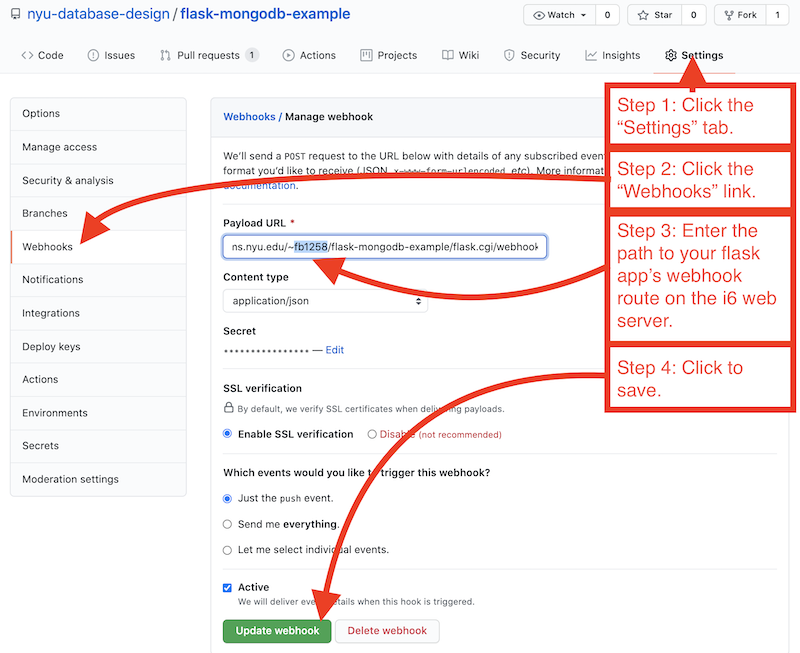

# Flask-MongoDB Example Web App

A simple example of a web app using [pymongo](https://pymongo.readthedocs.io/en/stable/index.html) to interact with a MongoDB database.

It is possible to run this app remotely or locally. Instructions are included for each.

## Run locally

To run this app locally, first clone this repository to your local machine...

`git clone url-to-this-repository`

... and then do the following:

### Set up a Python virtual environment

This command creates a new virtual environment with the name `.venv`:

```bash
python3 -m venv .venv
```

#### Activate the virtual environment

To activate the virtual environment named `.venv`...

On Mac:

```bash
source .venv/bin/activate
```

On Windows:

```bash
.venv\Scripts\activate.bat
```

#### Install the dependencies into the virtual environment

The file named, `requirements.txt` contains a list of dependencies - other Python modules that this app depends upon to run.

To install the dependencies into the currently-active virtual environment, use `pip`, the default Python "package manager" - software that takes care of installing the correct version of any module into your in the correct place for the current environment.

```bash
pip3 install -r requirements.txt
```

### Set up a local MongoDB database server

If running this app locally, you will not be able to connect to the NYU CS Department's MongoDB server. So you must have your app connect to either a cloud hosted database server, such as [MongoDB Atlas](https://www.mongodb.com/cloud/atlas), or download [MongoDB Community Server](https://www.mongodb.com/try/download/community) and run a local database server on your own machine.

### Run the app

1. define two environment variables from the command line: `export FLASK_APP=app.py` and `export FLASK_ENV=development`
1. copy the file named `env.example` into a new file named `.env`, and enter your own MongoDB database connection credentials into that file where indicated.
1. start flask with `flask run` - this will output an address at which the app is running locally, e.g. https://127.0.0.1:5000. Visit that address in a web browser.
1. in some cases, the command `flask` will not be found when attempting `flask run`... you can alternatively launch it with `python3 -m flask run --host=0.0.0.0 --port=10000`.

## Host on a web server

The following steps outline how to host this application on NYU's **i6**.cims.nyu.edu web server. Other servers may vary.

1. Familiarize yourself with web hosting steps on a CIMS server from the link: https://cims.nyu.edu/webapps/content/systems/userservices/webhosting.
1. remotely log into the server using `ssh`.
1. navigate into your web server account's `public_html` directory using `cd public_html`.
1. clone this repository with `git clone url-to-this-repository`.
1. navigate into the directory that was created by the clone operation.
1. copy the file named `env.example` into a new file named `.env` (using `cp env.example .env`).
1. edit the `.env` file using `emacs .env`, and enter your own MongoDB database connection credentials into that file where indicated. Save the changes within emacs by typing `Control-x` then `Control-s`. Exit emacs by typing, `Control-x` then `Control-c`.
1. Make the files named `flask.cgi` executable by all with the command, `chmod a+x flask.cgi`.
1. Your app should now be live on the web at https://i6.cims.nyu.edu/~$USER/$flask-app-directory/flask.cgi, where `$USER` is replaced with your own **i6** username and `$flask-app-directory` is replaced with the name of the sub-directory within `public_html` where your flask app code resides. Visit that address in your preferred web browser.

## Continuous deployment

While not required, it is possible to automatically update a copy of this web app anytime new changes to the code are pushed to GitHub. Such an automatic update of a deployed web app is known as "continuous deployment".

Each repository on GitHub has a set of Settings for Webhooks. In those settings, it is possible to enter a "Payload URL" - GitHub will automatically issue an HTTP POST request to any URL you place there. The example web app code has a route designed to accept a webhook request from GitHub. That route automatically perform a `git pull` operation on the app's source code repository to update the code each time such a webhook request occurs.



If attempting to test this webhook technique on a local instance of the web app, GitHub will not be able to make requests to your local machine. To solve this, is possible to use a tool such as [ngrok](https://ngrok.com/) to provide a public URL that forwards requests to your local machine. In such a scenario, with ngrok installed, you would set up ngrok to forward all HTTP requests to port `5000` of your local machine with the command, `ngrok http 5000`. Then enter the appropriate public ngrok address - something like `https://7ccd453a429f.ngrok.io/webhook/` - into the GitHub webhook "Payload URL" setting.
